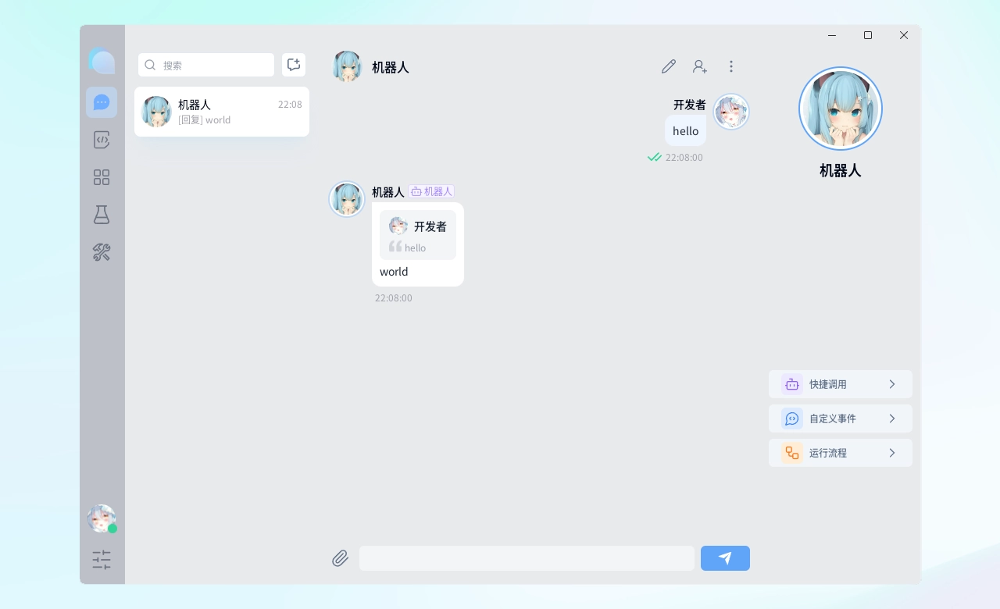
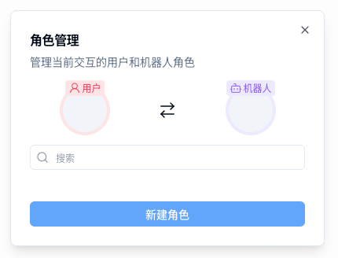
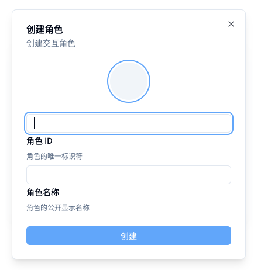
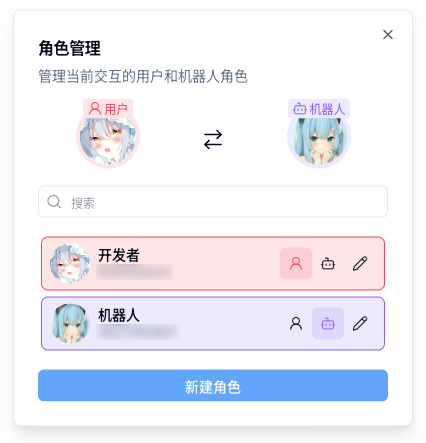
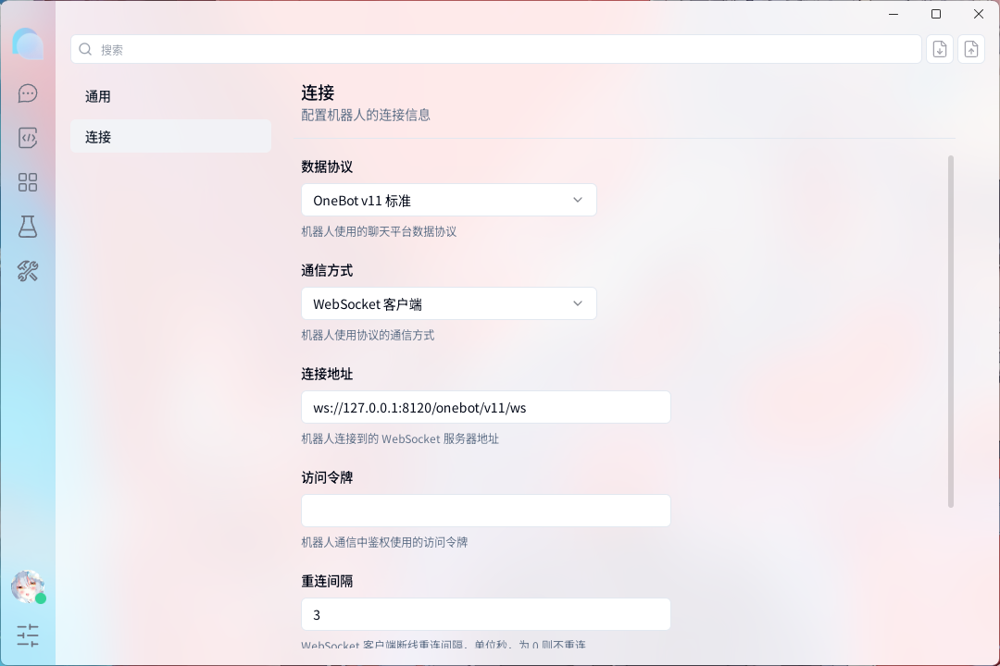

  <a href="https://github.com/zhongwen-4-fraq-plugins/meow">
     
    
     
    <strong>Matcha for Milky</strong>
  </a>
   
  Fraq 插件测试工具

  
   
  
  
  
   
  <a href="https://github.com/zhongwen-4-fraq-plugins/meow/releases" target="__blank">
    <strong>📦️ 下载安装包</strong>
  </a>

  <picture>
    <source media="(prefers-color-scheme: dark)" srcset="./docs/preview-dark.webp">
    <source media="(prefers-color-scheme: light)" srcset="./docs/preview-light.webp">
    
  </picture>

Matcha for Milky 是一个面向 Fraq 插件开发的桌面测试工具，能够模拟好友、群聊、消息、文件和通知，并通过 Milky 与插件交互。

它旨在降低开发者的调试与测试的负担，从而更有效率的专注于功能开发。

> Matcha for Milky 基于 [Matcha 0.4.8](https://github.com/A-kirami/matcha) 开发，并保留其 AGPL-3.0 许可证和原作者归属。

## Fraq 与 Milky

Matcha for Milky 内置 [Milky](https://milky.ntqqrev.org/) 1.2 协议端，可直接连接使用 Milky 的 Fraq 应用。

在设置中选择 `Milky 1.2` 后，Matcha for Milky 默认监听 `127.0.0.1:30001`，提供以下接口：

- `POST /api/{endpoint}`：调用 Matcha for Milky 中的好友、群聊与消息行为。
- `GET /event`：通过 WebSocket 或 SSE 接收模拟事件。
- `Authorization: Bearer <token>`：设置访问令牌后启用鉴权。

Fraq 可使用 `Context.fromUrl('http://127.0.0.1:30001')` 连接这个协议端。完整支持情况见下方“协议适配”中的 Milky 1.2 标准清单。

## ✨ 特性

- 小而美，轻巧体积，简约 UI
- 全平台支持（Windows，Mac，Linux）
- 多协议适配支持
- 支持多用户多群组
- 支持多媒体消息（图片、语音、视频）
- 原始事件展示

## 🚀 快速上手

### 创建角色

点击侧边栏底部的圆形按钮，打开角色管理面板。

<picture>
  <source media="(prefers-color-scheme: dark)" srcset="./docs/user-manage-dark.webp">
  <source media="(prefers-color-scheme: light)" srcset="./docs/user-manage-light.webp">
  
</picture>

点击“新建角色”，填写角色信息并创建。

<picture>
  <source media="(prefers-color-scheme: dark)" srcset="./docs/create-user-dark.webp">
  <source media="(prefers-color-scheme: light)" srcset="./docs/create-user-light.webp">
  
</picture>

### 设置用户与机器人

点击角色列表中的按钮，将角色设置为用户和机器人。

<picture>
  <source media="(prefers-color-scheme: dark)" srcset="./docs/bot-user-dark.webp">
  <source media="(prefers-color-scheme: light)" srcset="./docs/bot-user-light.webp">
  
</picture>

### 设置连接

点击侧边栏底部的菜单按钮，打开设置页面，在设置页面中，选择“连接”设置，填写连接信息。

<picture>
  <source media="(prefers-color-scheme: dark)" srcset="./docs/connect-settings-dark.webp">
  <source media="(prefers-color-scheme: light)" srcset="./docs/connect-settings-light.webp">
  
</picture>

提示连接成功后，即可开始使用。

## 🔌 协议适配

- 

  
Milky 1.2 标准

  当前支持情况基于 Milky 1.2.2。勾选表示 Matcha for Milky 已提供对应的模拟行为。

  ### 动作

  - [x] 获取登录信息（get_login_info）
  - [x] 获取协议端信息（get_impl_info）
  - [x] 获取用户个人信息（get_user_profile）
  - [x] 获取好友列表（get_friend_list）
  - [x] 获取好友信息（get_friend_info）
  - [x] 获取群列表（get_group_list）
  - [x] 获取群信息（get_group_info）
  - [x] 获取群成员列表（get_group_member_list）
  - [x] 获取群成员信息（get_group_member_info）
  - [x] 获取置顶的好友和群列表（get_peer_pins）
  - [x] 设置好友或群的置顶状态（set_peer_pin）
  - [x] 设置 QQ 账号头像（set_avatar）
  - [x] 设置 QQ 账号昵称（set_nickname）
  - [x] 设置 QQ 账号个性签名（set_bio）
  - [x] 获取自定义表情 URL 列表（get_custom_face_url_list）
  - [x] 获取 Cookies（get_cookies）
  - [x] 获取 CSRF Token（get_csrf_token）
  - [x] 发送私聊消息（send_private_message）
  - [x] 发送群聊消息（send_group_message）
  - [x] 撤回私聊消息（recall_private_message）
  - [x] 撤回群聊消息（recall_group_message）
  - [x] 获取消息（get_message）
  - [x] 获取历史消息列表（get_history_messages）
  - [x] 获取临时资源链接（get_resource_temp_url）
  - [x] 获取合并转发消息内容（get_forwarded_messages）
  - [x] 标记消息为已读（mark_message_as_read，仅返回成功）
  - [x] 发送好友戳一戳（send_friend_nudge）
  - [x] 发送名片点赞（send_profile_like，仅返回成功）
  - [x] 删除好友（delete_friend）
  - [x] 获取好友请求列表（get_friend_requests）
  - [x] 同意好友请求（accept_friend_request）
  - [x] 拒绝好友请求（reject_friend_request）
  - [x] 设置群名称（set_group_name）
  - [x] 设置群头像（set_group_avatar）
  - [x] 设置群名片（set_group_member_card）
  - [x] 设置群成员专属头衔（set_group_member_special_title）
  - [x] 设置群管理员（set_group_member_admin）
  - [x] 设置群成员禁言（set_group_member_mute）
  - [x] 设置群全员禁言（set_group_whole_mute）
  - [x] 踢出群成员（kick_group_member）
  - [x] 获取群公告列表（get_group_announcements）
  - [x] 发送群公告（send_group_announcement）
  - [x] 删除群公告（delete_group_announcement）
  - [x] 获取群精华消息列表（get_group_essence_messages）
  - [x] 设置群精华消息（set_group_essence_message）
  - [x] 退出群（quit_group）
  - [x] 发送群消息表情回应（send_group_message_reaction，仅返回成功）
  - [x] 发送群戳一戳（send_group_nudge）
  - [x] 获取群通知列表（get_group_notifications）
  - [x] 同意入群或邀请他人入群请求（accept_group_request）
  - [x] 拒绝入群或邀请他人入群请求（reject_group_request）
  - [x] 同意他人邀请自身入群（accept_group_invitation）
  - [x] 拒绝他人邀请自身入群（reject_group_invitation）
  - [x] 上传私聊文件（upload_private_file）
  - [x] 上传群文件（upload_group_file）
  - [x] 获取私聊文件下载链接（get_private_file_download_url）
  - [x] 获取群文件下载链接（get_group_file_download_url）
  - [x] 获取群文件列表（get_group_files）
  - [x] 移动群文件（move_group_file）
  - [x] 重命名群文件（rename_group_file）
  - [x] 删除群文件（delete_group_file）
  - [x] 创建群文件夹（create_group_folder）
  - [x] 重命名群文件夹（rename_group_folder）
  - [x] 删除群文件夹（delete_group_folder）

  ### 事件

  - [x] 机器人离线事件（bot_offline）
  - [x] 消息接收事件（message_receive）
  - [x] 消息撤回事件（message_recall）
  - [x] 会话置顶变更事件（peer_pin_change）
  - [x] 好友请求事件（friend_request）
  - [x] 入群请求事件（group_join_request）
  - [x] 群成员邀请他人入群请求事件（group_invited_join_request）
  - [x] 他人邀请自身入群事件（group_invitation）
  - [x] 好友戳一戳事件（friend_nudge）
  - [x] 好友文件上传事件（friend_file_upload）
  - [x] 群管理员变更事件（group_admin_change）
  - [x] 群精华消息变更事件（group_essence_message_change）
  - [x] 群成员增加事件（group_member_increase）
  - [x] 群成员减少事件（group_member_decrease）
  - [x] 群名称变更事件（group_name_change）
  - [x] 群消息表情回应事件（group_message_reaction）
  - [x] 群禁言事件（group_mute）
  - [x] 群全体禁言事件（group_whole_mute）
  - [x] 群戳一戳事件（group_nudge）
  - [x] 群文件上传事件（group_file_upload）
  

## 📋 路线图

请访问本项目的 [Issues](https://github.com/zhongwen-4-fraq-plugins/meow/issues)

## 🤝 贡献

请参阅[贡献指南](./.github/CONTRIBUTING.md)

### 🍻 鸣谢

Matcha for Milky 基于 Matcha 开发，感谢原项目的所有贡献者：

## 🎊 活动

## 📄 许可证

Code: AGPL-3.0 - 2023 - Akirami

Logo: CC-BY-NC-ND, Designs by Akirami

Upstream: [A-kirami/matcha](https://github.com/A-kirami/matcha)
